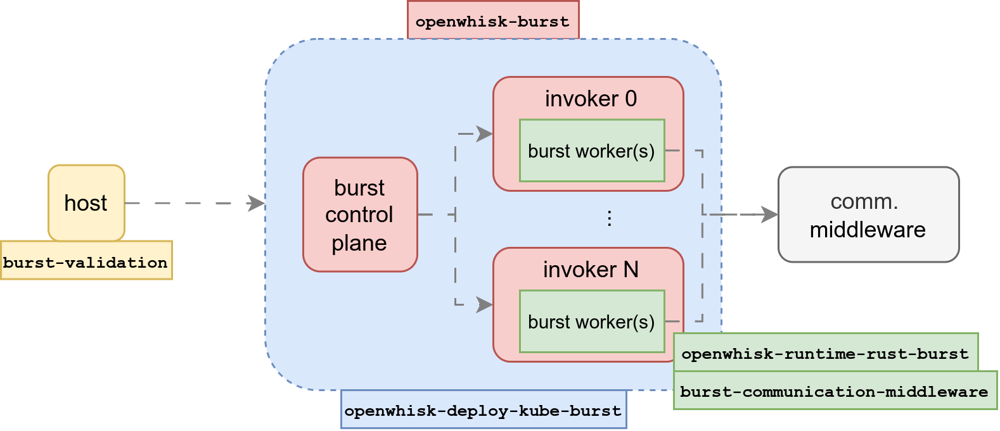

# Burst Computing Artifact Documentation
Welcome to the Burst Computing (paper published in USENIX ATC '25) artifact documentation! This document provides a comprehensive guide to the Burst Computing system, including its the different repositories that conform the platform, and usage instructions.

## Constellation of repositories
The Burst Computing framework is organized into several repositories, each with its own purpose. Big picture diagram of the repositories is shown below.

Here is a brief description of the most rellevant repositories:
- `openwhisk-burst`: Fork of the OpenWhisk project, modified to support burst computing. 
- `openwhisk-deploy-kube-burst`: repository for deploying modified OpenWhisk in a Kubernetes cluster with burst computing support.
- `openwhisk-runtime-rust-burst`: Fork of the OpenWhisk Rust runtime, modified to support burst computing.
- `burst-communication-middleware`: Source code of the communication middleware used in the Burst Computing framework. This code is embedded in the OpenWhisk Rust runtime for allowing worker communication.
- `burst-validation`: Repository for validating the Burst Computing framework. This repository contains the applications that are used to test the framework.

## Hello World example
This example wants to show how to use the Burst Computing framework to run a minimal setup (single host, prebuilt images, no data configuration). Please, enter to see the details of the example:
- [Hello world example](./hello.md)

## Detailed Instructions
This section provides detailed instructions for reproduce the figure results of the paper. There are a dedicated file per figure. Please, find it in the following links:
- [Figure 1: Faas startup times](./fig1.md)
- [Figure 6: Burst workers startup latencies](./fig6.md)
- [Figure 7: Simultaneity - FaaS vs Burst](./fig7.md)
- [Figure 8: Cooperative downloading](./fig8.md)
- [Figure 9: BCM - Throughput](./fig9.md)
- [Figure 10: BCM - Latencies](./fig10.md)
- [Figure 11: Pagerank application](./fig11.md)
- [Figure 12: Terasort application](./fig12.md)
